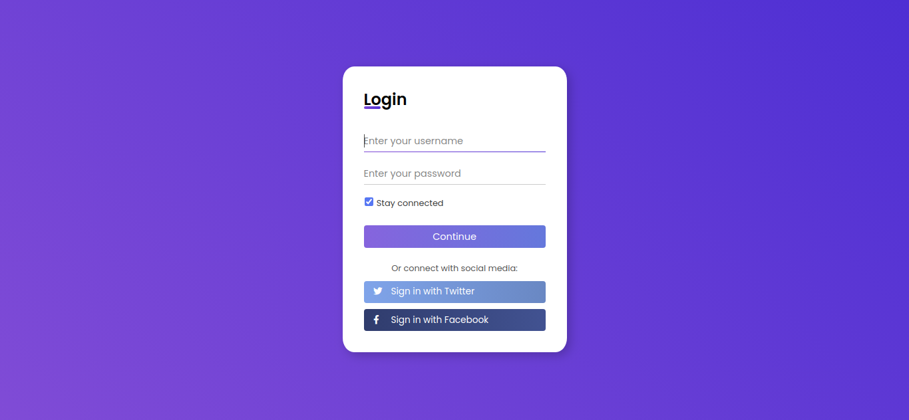

## <h1 align="center"> FORMULÁRIO DE LOGIN </h1>
### <h2 align="center"> Feito em HTML e CSS </h2>

Login page feita com HTML e CSS para me aprofundar nas linguagens e principalmente responsividade e animações e transições feitas apenas com CSS, sem a necessidade da utilização de Javascript. Fiz a partir de um vídeo, porém com algumas modificações e melhorias feitas por conta própria.

### <h2 align="center"> Print da página: </h2>

<h2 align="center">  </h2>

### <h2 align="center"> Efeito input e checkbox </h2>

<h2 align="center">  </h2>
